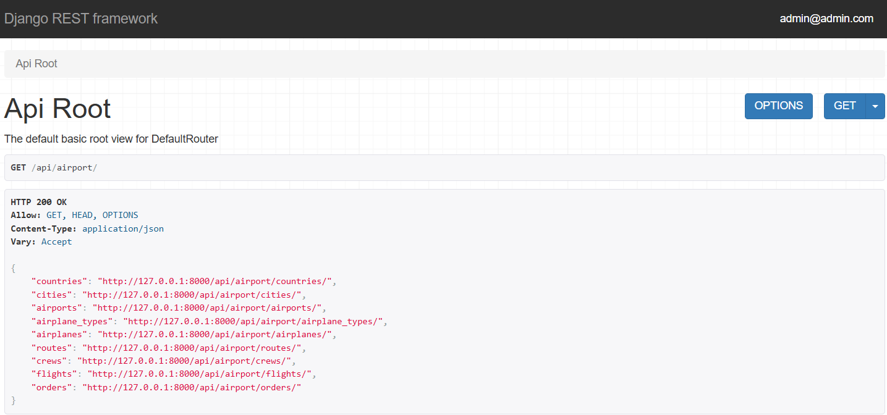

# Airport API

Airport API is a REST API for managing countries, cities, airports, airplanes, routes, crews, flights, orders, tickets.

The project is built with Django REST Framework and PostgreSQL. It can be run either locally using Django's development server or with Docker Compose.



## Technologies

- Python 3.13
- Django 6.1
- Django REST Framework
- PostgreSQL 16
- Docker & Docker Compose
- JWT Authentication
- django-filter
- drf-spectacular
- Pillow

## Features

- JWT authentication
- Custom user model
- Custom permissions
- Countries, cities and airports management
- Airplanes and airplane types
- Routes, flights and crews
- Orders and tickets
- Filtering and pagination
- Airplane image upload

## Installation

```bash
git clone <https://github.com/Oh-no-dotcom/airport-api>
cd airport-api

# Local setup
python -m venv venv
source venv/bin/activate  # Windows: venv\Scripts\activate
pip install -r requirements.txt

# Create .env file with PostgreSQL configuration
POSTGRES_DB=airport_api
POSTGRES_USER=airport_api
POSTGRES_PASSWORD=airport_api
POSTGRES_HOST=localhost
POSTGRES_PORT=5432

SECRET_KEY=your-secret-key
DEBUG=True

python manage.py migrate
python manage.py runserver

# Or run with Docker
# Make sure Docker Desktop is running

docker compose up --build

# Load sample data
docker compose exec app python manage.py loaddata data.json
# Sample admin credentials
# Email: admin@admin.com
# Password: 1qazcde3123
